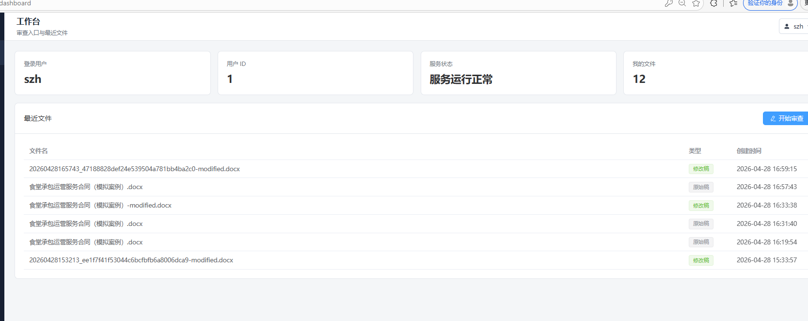
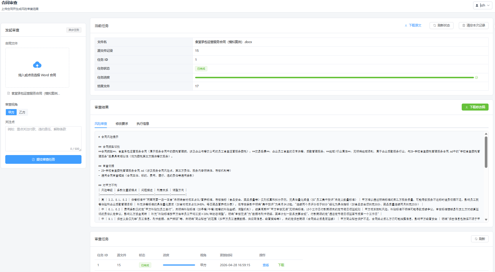
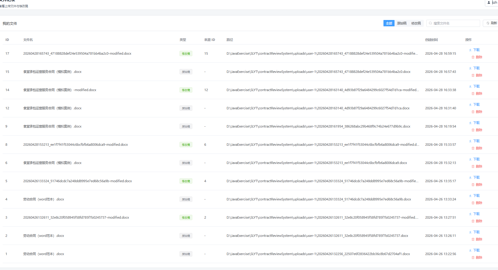
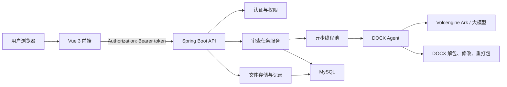
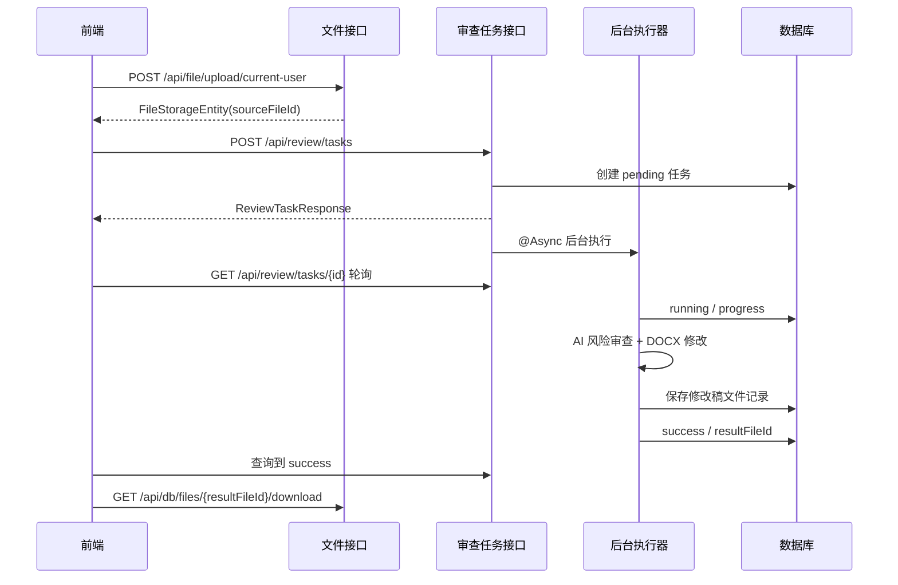

# 合同审查系统

基于 Spring Boot、Vue 3 和大模型能力构建的合同智能审查系统。系统支持用户登录、DOCX 合同上传、甲方/乙方视角风险审查、异步审查任务、修改稿生成、文件记录管理、用户管理和系统运行监控。

当前工作区中，后端主工程位于 `contractReviewSystem`，前端工程位于同级目录 `../vue2`。

## 项目截图

### 工作台



### 合同审查成功案例



### 文件上传与审查任务



## 核心功能

- 用户认证：支持登录、注册、JWT Access Token、Refresh Token 自动刷新。
- 权限控制：后端使用 `@RequiresPermissions` 对用户、文件、审查、监控等接口做权限校验。
- 文件管理：支持 DOCX 文件上传、文件记录查询、按源文件查询修改稿、下载、软删除。
- 合同审查：支持按甲方或乙方视角生成风险审查报告和修改建议。
- 异步任务：合同审查采用 `POST /api/review/tasks` 创建任务，后台异步执行，前端轮询任务状态。
- DOCX 修改：后台调用 DOCX Agent 对 Word 文档执行修改，生成可下载的修改稿。
- 任务追踪：审查任务按 `pending -> running -> success/failed` 流转，保存进度、风险报告、生成要求和失败原因。
- 系统监控：前端可查看服务健康状态、JVM、Java、系统和内存信息。

## 技术栈

### 后端

- Java 17
- Spring Boot 2.7.0
- Spring MVC
- Spring AOP
- Spring Validation
- Spring Async
- MyBatis 注解 Mapper
- MySQL
- Redis 配置预留
- JWT
- Apache POI / PDFBox
- LangChain4j / Volcengine Ark 大模型接口
- 自定义 DOCX Agent 与合同风险知识库

### 前端

- Vue 3
- Vite 6
- Vue Router 4
- Pinia
- Axios
- Element Plus
- @element-plus/icons-vue

## 目录结构

```text
contractReviewSystem/
├─ contractReviewSystem-common/       # 通用返回体、异常、工具类、用户上下文
├─ contractReviewSystem-service/      # 业务主体：认证、权限、文件、审查任务、DOCX Agent
├─ contractReviewSystem-web/          # Spring Boot 启动模块、配置、schema.sql
├─ .trae/skills/legal-contract-risk/  # 合同风险审查知识库
├─ docs/                              # 项目文档与截图
├─ tools/                             # 数据提取等辅助工具
├─ uploads/                           # 本地上传文件目录
├─ work/                              # DOCX Agent 工作目录
└─ pom.xml                            # Maven 多模块父工程

../vue2/
├─ src/api/                           # 前端接口封装
├─ src/stores/                        # Pinia 状态管理
├─ src/router/                        # 前端路由
├─ src/views/                         # 页面视图
├─ src/utils/                         # 格式化、下载等工具
├─ vite.config.js                     # Vite 配置与代理
└─ package.json
```

## 系统架构



## 合同审查流程



## 后端模块说明

### `contractReviewSystem-common`

提供系统通用能力：

- `Result<T>` 和 `PageResult<T>`：统一接口返回结构。
- `CustomException`、`BusinessExceptionEnum`、`GlobalExceptionHandler`：统一异常和 HTTP 状态处理。
- `UserContextHolder`：在请求和异步任务中保存当前用户 ID。
- 工具类：文件、HTTP、Excel、日期、校验等通用能力。

### `contractReviewSystem-service`

承载主要业务逻辑：

- `AuthController` / `AuthService`：登录、注册、刷新 Token。
- `FileController`：物理文件上传、下载、删除。
- `FileStorageRecordController` / `FileStorageRecordService`：文件记录创建、查询、下载、软删除。
- `ReviewTaskController` / `ReviewTaskService` / `ReviewTaskExecutor`：异步合同审查任务。
- `DocxDocumentService`：组织风险审查、修改要求生成和 DOCX 修改。
- `DocxSkillAgentService`：DOCX 修改 Agent 执行链路。
- `PermissionAspect`：基于注解的权限拦截。
- `AsyncConfig`：审查任务线程池配置。
- `FileLifecycleCleanupTask`：临时文件和 Agent 工作目录清理。

### `contractReviewSystem-web`

后端启动模块：

- `ContractReviewSystemApplication`：Spring Boot 启动入口。
- `application.yml`：数据库、JWT、文件目录、大模型、DOCX Agent 等配置。
- `schema.sql`：初始化用户、角色、权限、文件表和审查任务表。

## 前端模块说明

### 页面

- `LoginView.vue`：登录与注册。
- `DashboardView.vue`：工作台，展示登录用户、服务状态、文件数和最近文件。
- `ReviewView.vue`：合同上传、审查任务提交、任务轮询、结果展示、历史任务下载。
- `FilesView.vue`：文件记录列表、筛选、下载、删除。
- `UsersView.vue`：用户创建与用户列表。
- `MonitorView.vue`：系统运行信息。
- `MainLayout.vue`：系统主布局、菜单和顶部栏。

### 接口层

- `request.js`：Axios 实例、Token 注入、统一 `Result<T>` 解析、401 刷新 Token、错误提示。
- `auth.js`：登录、注册、刷新 Token。
- `files.js`：上传、文件记录、下载、删除。
- `reviewTasks.js`：创建审查任务、查询单个任务、查询任务列表。
- `monitor.js`：健康检查、系统信息。
- `users.js`：用户创建、用户列表、用户详情。

### 状态管理

- `auth.js`：当前用户、登录、注册、退出。
- `review.js`：上传文件、创建审查任务、轮询状态、当前任务、任务列表。
- `files.js`：文件列表、文件下载、删除。
- `users.js`：用户列表和创建。
- `monitor.js`：系统健康状态和运行信息。

## 数据库表

`schema.sql` 会初始化以下核心表：

- `sys_user`：用户表。
- `sys_role`：角色表。
- `sys_permission`：权限表。
- `sys_user_role`：用户角色关系表。
- `sys_role_permission`：角色权限关系表。
- `file_storage`：文件存储记录表。
- `review_task`：合同审查任务表。

`review_task` 核心字段：

| 字段 | 说明 |
| --- | --- |
| `id` | 任务 ID |
| `user_id` | 任务所属用户 |
| `source_file_id` | 原始合同文件记录 ID |
| `result_file_id` | 修改稿文件记录 ID |
| `task_type` | 任务类型，当前为 `docx_review_modify` |
| `status` | `pending`、`running`、`success`、`failed` |
| `progress` | 任务进度，0-100 |
| `perspective` | 审查视角，`PARTY_A` 或 `PARTY_B` |
| `user_focus` | 用户关注点 |
| `risk_report` | 风险审查报告 |
| `generated_requirement` | 生成的修改要求 |
| `error_message` | 失败原因 |

## 核心接口

所有业务接口默认以 `/api` 开头。

### 认证

| 方法 | 路径 | 说明 |
| --- | --- | --- |
| `POST` | `/api/auth/login` | 登录 |
| `POST` | `/api/auth/register` | 注册 |
| `POST` | `/api/auth/refresh` | 刷新 Token |

### 文件

| 方法 | 路径 | 说明 |
| --- | --- | --- |
| `POST` | `/api/file/upload/current-user` | 上传当前用户文件，并写入文件记录 |
| `GET` | `/api/file/download?path=...` | 按物理路径下载文件 |
| `DELETE` | `/api/file/delete?path=...` | 按物理路径删除文件 |
| `POST` | `/api/db/files` | 创建文件记录 |
| `GET` | `/api/db/files/{id}` | 查询文件记录 |
| `GET` | `/api/db/files/{id}/download` | 按文件记录下载 |
| `DELETE` | `/api/db/files/{id}` | 软删除文件记录 |
| `GET` | `/api/db/files/user/{userId}` | 查询用户文件列表 |
| `GET` | `/api/db/files/source/{sourceFileId}` | 查询某个源文件的修改稿 |

### 审查任务

| 方法 | 路径 | 说明 |
| --- | --- | --- |
| `POST` | `/api/review/tasks` | 创建异步审查任务 |
| `GET` | `/api/review/tasks/{id}` | 查询单个审查任务 |
| `GET` | `/api/review/tasks` | 查询当前用户审查任务列表 |

创建任务请求示例：

```json
{
  "sourceFileId": 1,
  "perspective": "PARTY_A",
  "userFocus": "重点关注付款、违约责任和解除条款"
}
```

任务状态示例：

```json
{
  "id": 12,
  "sourceFileId": 1,
  "resultFileId": 8,
  "taskType": "docx_review_modify",
  "status": "success",
  "progress": 100,
  "perspective": "PARTY_A",
  "riskReport": "...",
  "generatedRequirement": "..."
}
```

### 用户与监控

| 方法 | 路径 | 说明 |
| --- | --- | --- |
| `POST` | `/api/db/users` | 创建用户 |
| `GET` | `/api/db/users` | 用户列表 |
| `GET` | `/api/db/users/{id}` | 用户详情 |
| `GET` | `/api/monitor/health` | 健康检查 |
| `GET` | `/api/monitor/info` | 系统运行信息 |

## 运行环境

建议环境：

- JDK 17
- Maven 3.8+
- MySQL 8+
- Node.js 18+ 或 20+
- Yarn 1.x
- Python 环境，用于 DOCX Agent 工具链
- 可访问 Volcengine Ark 或兼容的大模型接口

## 后端启动

1. 创建数据库，或使用配置中的 `createDatabaseIfNotExist=true` 自动创建。

```sql
CREATE DATABASE IF NOT EXISTS contract_review_system
  DEFAULT CHARACTER SET utf8mb4
  COLLATE utf8mb4_unicode_ci;
```

2. 修改配置。

主要配置位于：

```text
contractReviewSystem-web/src/main/resources/application.yml
```

需要重点确认：

- `spring.datasource.url`
- `spring.datasource.username`
- `spring.datasource.password`
- `auth.jwt.secret`
- `system.uploadPath`
- `file.lifecycle.docx-agent-work-root`
- `ark.apiKey`
- `ark.baseUrl`
- `ark.model`
- `docx-agent.skillPath`
- `docx-agent.legalContractRiskSkillPath`
- `docx-agent.pythonCommand`

生产环境不要把数据库密码、JWT Secret 和大模型 API Key 写死在代码仓库中，建议改为环境变量或外部配置。

3. 编译后端。

```bash
cd D:\JavaExercise\SLYT\contractReviewSystem
mvn -pl contractReviewSystem-web -am -DskipTests compile
```

4. 启动后端。

```bash
mvn -pl contractReviewSystem-web -am spring-boot:run
```

默认端口：

```text
http://localhost:8080
```

## 前端启动

前端位于：

```text
D:\JavaExercise\SLYT\vue2
```

1. 安装依赖。

```bash
cd D:\JavaExercise\SLYT\vue2
yarn install
```

2. 确认 `.env.development`。

```env
VITE_API_BASE_URL=/api
VITE_BACKEND_URL=http://localhost:8080
```

3. 启动前端。

```bash
yarn dev
```

默认访问：

```text
http://localhost:5173
```

Vite 会把 `/api` 代理到 `VITE_BACKEND_URL`。

4. 打包前端。

```bash
yarn build
```

## 权限说明

系统通过权限码控制接口访问。初始化脚本会创建 `ADMIN` 和 `USER` 两类角色，并写入基础权限。

常见权限码：

- `user:create`
- `user:view`
- `user:list`
- `file:upload`
- `file:download`
- `file:list`
- `file:delete`
- `file:record:create`
- `review:modify`
- `monitor:view`

后端接口通过 `@RequiresPermissions("权限码")` 标注。普通用户默认拥有文件上传、下载、列表、删除、文件记录创建和合同审查权限；管理员拥有全部权限。

## 文件与任务生命周期

- 上传文件会保存到 `system.uploadPath` 下，并写入 `file_storage`。
- 修改稿由 DOCX Agent 生成，并以 `modified` 类型写入 `file_storage`。
- 审查任务写入 `review_task`，成功后关联 `result_file_id`。
- DOCX Agent 工作目录会作为临时文件记录，后台清理任务按 `file.lifecycle.temp-ttl-hours` 和 `cleanup-cron` 清理。
- 前端文件列表只展示 `active` 文件记录，不展示后台临时工作目录。

## 常见问题

### 前端创建任务后一直运行中

检查后端控制台日志、`logs/app.log`、大模型接口配置、Python 路径和 DOCX Agent skill 路径。异步任务失败后，前端任务列表会展示 `failed` 和错误信息。

### 上传成功但任务创建失败

通常是权限不足、Token 失效、源文件不是 DOCX，或文件记录不属于当前用户。确认用户拥有 `review:modify` 权限。

### 下载结果文件名不正确

前端历史任务下载会先通过 `resultFileId` 查询文件记录，再按文件记录名下载。若历史旧数据已保存为物理文件名，新生成的数据会按当前后端逻辑保存。

### 数据库中文乱码

确认 MySQL、连接 URL、表字符集均为 `utf8mb4`。配置中已使用：

```text
useUnicode=true&characterEncoding=UTF-8&serverTimezone=Asia/Shanghai
```

### 大模型调用失败

检查 `ark.apiKey`、`ark.baseUrl`、`ark.model` 和网络连通性。生产环境建议使用环境变量注入 API Key。

## 开发与验证命令

后端编译：

```bash
mvn -pl contractReviewSystem-web -am -DskipTests compile
```

后端服务模块编译：

```bash
mvn -pl contractReviewSystem-service -am -DskipTests compile
```

前端构建：

```bash
cd D:\JavaExercise\SLYT\vue2
yarn build
```

## 后续可优化方向

- 前端增加任务详情页和任务筛选。
- 审查任务增加取消、重试、排队位置展示。
- 后端返回源文件名和结果文件名，减少前端二次查询。
- 增加 OpenAPI 文档或 Apifox 自动同步。
- 将敏感配置迁移到环境变量。
- 增加单元测试和端到端流程测试。
- 把前端目录合并回后端仓库或统一 monorepo 结构。
